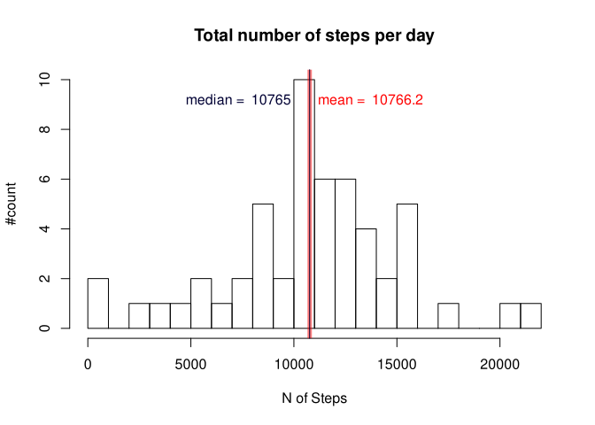
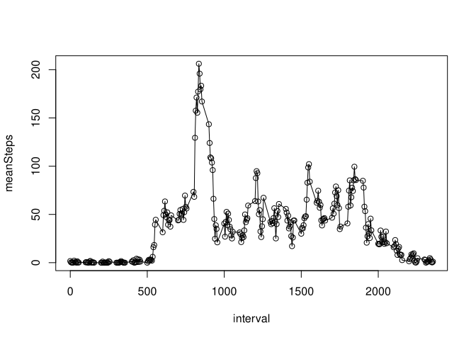
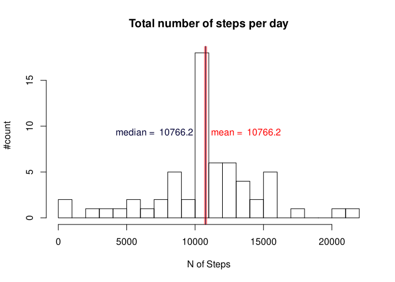
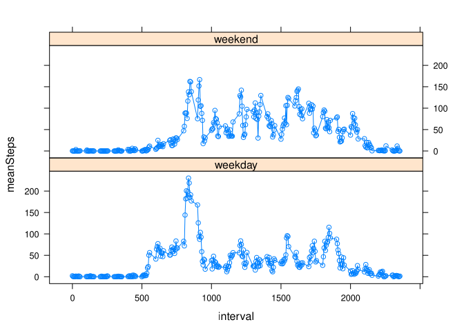

[comment]: ==================================================================
[comment]: ==================================================================
[comment]: ==================================================================
## Make default settings for the code chunks

```r
library(knitr)
opts_chunk$set( echo=TRUE, fig.path='figure/', cache=FALSE, fig.height=5, fig.width=7)
```

[comment]: ==================================================================
[comment]: ==================================================================
[comment]: ==================================================================

## Loading and preprocessing the data
### Loading the data

```r
rm(list=ls())
unzip(zipfile = "activity.zip")
sDat <- read.csv("activity.csv")
```
### Loading additional libraries

```r
library(tidyr)
library(lattice)
library(dplyr)
```

```
## 
## Attaching package: 'dplyr'
```

```
## The following objects are masked from 'package:stats':
## 
##     filter, lag
```

```
## The following objects are masked from 'package:base':
## 
##     intersect, setdiff, setequal, union
```

[//]: ==================================================================
[//]: ==================================================================
[//]: ==================================================================

## What is mean total number of steps taken per day?
### Make a histogram of the total number of steps taken each day

```r
tSteps_by_Date <- sDat %>% group_by(date) %>% summarize(totSteps = sum(steps))

mean_tSteps_by_Date <- mean(tSteps_by_Date$totSteps, na.rm = T)
median_tSteps_by_Date <- median(tSteps_by_Date$totSteps, na.rm = T)
```


```r
hist( tSteps_by_Date$totSteps,
      breaks = 24,
      main = "Total number of steps per day",
      xlab = "N of Steps", ylab = "#count" )
abline(v = mean_tSteps_by_Date, col = rgb(1,0,0,0.5), lwd="5")
text(mean_tSteps_by_Date+400, 9, 
     paste("mean = ", format(mean_tSteps_by_Date, digits = 6)), 
     col = rgb(1,0,0), adj = c(0, 0))
abline(v = median_tSteps_by_Date, col = rgb(0,0,0.2,1), lwd="1")
text(mean_tSteps_by_Date-900, 9, 
     paste("median = ", format(median_tSteps_by_Date, digits = 6)), 
     col = rgb(0,0,0.2), adj = c(1, 0))
```

<!-- -->

### Calculate and report the mean and median total number of steps taken per day
The *mean* of total number of steps taken per day is **10766.2**.  
The *median* of total number of steps taken per day is **10765**.

[comment]: ==================================================================
[comment]: ==================================================================
[comment]: ==================================================================

## What is the average daily activity pattern?
### Make a time series plot of the 5-minute interval and the average number of steps taken, averaged across all days

```r
mSteps_by_Interval <- sDat %>% group_by(interval) %>% summarize(meanSteps = mean(steps, na.rm = T))
plot(mSteps_by_Interval, type="o")
```

<!-- -->

### Which 5-minute interval, on average across all the days in the dataset, contains the maximum number of steps?

```r
maxStepsInterval <- mSteps_by_Interval$interval[which.max(mSteps_by_Interval$meanSteps)]
```
The interval with *max steps* is **835** with the average *number of steps* **206.1698113**.


[//]: ==================================================================
[//]: ==================================================================
[//]: ==================================================================

## Imputing missing values
### Calculate and report the total number of missing values in the dataset.

```r
totalNAs <- sum( is.na(sDat) )
totalNAsSteps <- sum( is.na(sDat$steps) )
```
The total number of NAs in the data set is **totalNAs = 2304**, and **totalNAsSteps = 2304** of them are in **steps** column.

### Devise a strategy for filling in all of the missing values in the dataset.
The selected NAs filling strategy is the replacement of NAs with the mean for a certain 5-minute interval.

### Create a new dataset that is equal to the original dataset but with the missing data filled in.

```r
sDatFixed <- sDat
ixNA <- which(is.na(sDat$steps))
sDatFixed$steps[ixNA] <- mSteps_by_Interval$meanSteps[ 
                          match(  sDat$interval[ixNA], mSteps_by_Interval$interval  )]
head(sDatFixed)
```

```
##       steps       date interval
## 1 1.7169811 2012-10-01        0
## 2 0.3396226 2012-10-01        5
## 3 0.1320755 2012-10-01       10
## 4 0.1509434 2012-10-01       15
## 5 0.0754717 2012-10-01       20
## 6 2.0943396 2012-10-01       25
```
### Make a histogram of the total number of steps taken each day.

```r
tSteps_by_DateF <- sDatFixed %>% group_by(date) %>% summarize(totSteps = sum(steps))

mean_tSteps_by_DateF <- mean(tSteps_by_DateF$totSteps, na.rm = F)
median_tSteps_by_DateF <- median(tSteps_by_DateF$totSteps, na.rm = F)
```

```r
hist( tSteps_by_DateF$totSteps,
      breaks = 24,
      main = "Total number of steps per day",
      xlab = "N of Steps", ylab = "#count" )
abline(v = mean_tSteps_by_DateF, col = rgb(1,0,0,0.5), lwd="5")
text(mean_tSteps_by_DateF+400, 9, 
     paste("mean = ", format(mean_tSteps_by_DateF, digits = 6)), 
     col = rgb(1,0,0), adj = c(0, 0))
abline(v = median_tSteps_by_DateF, col = rgb(0,0,0.2,1), lwd="1")
text(mean_tSteps_by_DateF-900, 9, 
     paste("median = ", format(median_tSteps_by_DateF, digits = 6)), 
     col = rgb(0,0,0.2), adj = c(1, 0))
```

<!-- -->
### Calculate and report the mean and median total number of steps taken per day. Do these values differ from the estimates from the first part of the assignment?

The new *mean* of total number of steps taken per day is **10766.2** (the old value was **10766.2**).  
The new *median* of total number of steps taken per day is **10766.2** (the old value was **10765**).

### What is the impact of imputing missing data on the estimates of the total daily number of steps?
It seems that the imputation of NAs only increased the *'central'* bin of the histogram, that has influenced only the *median* value, but not the *mean*.

[//]: ==================================================================
[//]: ==================================================================
[//]: ==================================================================

## Are there differences in activity patterns between weekdays and weekends?

### Create a new factor variable in the dataset with two levels -- "weekday" and "weekend" indicating whether a given date is a weekday or weekend day.

```r
sDatFixed2 <- sDatFixed

sDatFixed2$dayW <- weekdays(as.Date(sDatFixed2$date), abbreviate = T)
sDatFixed2$dayW <- sub("(Sa)|(So)","weekend",sDatFixed2$dayW)
sDatFixed2$dayW <- sub("(Mo)|(Di)|(Mi)|(Do)|(Fr)","weekday",sDatFixed2$dayW)

mSteps_by_IntervalF2 <- sDatFixed2 %>% group_by(interval, dayW) %>% summarize(meanSteps = mean(steps, na.rm = F))

head(mSteps_by_IntervalF2)
```

```
## # A tibble: 6 x 3
## # Groups:   interval [3]
##   interval dayW    meanSteps
##      <int> <chr>       <dbl>
## 1        0 weekday    2.25  
## 2        0 weekend    0.215 
## 3        5 weekday    0.445 
## 4        5 weekend    0.0425
## 5       10 weekday    0.173 
## 6       10 weekend    0.0165
```

### Make a panel plot containing a time series plot of the 5-minute interval and the average number of steps taken, averaged across all weekday days or weekend days.

```r
xyplot(meanSteps ~ interval | dayW, data = mSteps_by_IntervalF2, layout=c(1,2), type="o")
```

<!-- -->
